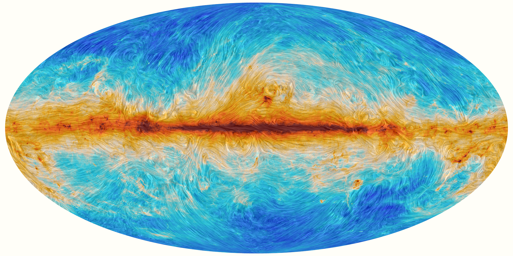

**Hi there, I am Thuong D. HOANG, a cosmologist and astrophysicist**

_Definition about me: Big Bang theory, Inflation, Cosmic Microwaves Background, Transision Edge Sensor (TES), Cryogenics system, Magnetic fields and star formation, Dust polarization_

---
# About

I am currently a lecturer/researcher in the Department of Space and Applications (DSA) at University of Science and Technology of Hanoi (USTH) since January 1, 2021. 
I obtained Ph.D in Physics of the Universe from AstroParticle and Cosmology (APC) laboratory, University of Paris, in 2018. 
After completing PhD, I won an appointment as a postdoctoral associate at Cornell University.

<!-- [Branching](https://hoangducthuong.github.io/images/IMG_7931.jpg) -->
<a href="https://hoangducthuong.github.io/cv"> > Read more about my CV.</a>

---
# Research

My research interests span both observational cosmology on `Cosmic Microwave Background (CMB)` Radiation measurement and roles of `magnetic fields` in star formation.  

Most of my work has been working on the simulation of systematic effects of CMB polarization measurement and instrumentation on superconducting `Transition Edge Sensor (TES)` for CMB experiments.  

On the other hand, I am also investigating data analysis of `magnetic fields` in molecular clouds to study the evolution and formation of stars.  
		
I has published scientific journals and conference proceeding papers. 

<a href="https://hoangducthuong.github.io/research"> > Read more about my Research.</a>

---
# Teaching

* Basic Programming (C)  
* Data Analysis and Visualization (Python) [[Materials]()]  
* Mordern Cosmology   
* Practical work: Advanced electronic system

---
# Talks

*   This is an unordered list following a header.
*   This is an unordered list following a header.
*   This is an unordered list following a header.

---
# Selected publications

1.  Thuong Duc Hoang, _Studying magnetic fields toward M17 using polarized thermal dust emission observed bySOFIA/HAWC+_. [In preparation]()
2.  Duc Thuong Hoang, Guillaume Patanchon, Martin Bucher, Tomotake Matsumura, Ranajoy Banerji, Hirokazu Ishino, Masashi Hazumi, and Jacques Delabrouille, _Bandpass mismatch error for satellite CMB experiments I: estimating the spurious signal_. [arXiv:1706.09486](https://arxiv.org/abs/1706.09486)
3. Ranajoy Banerji, Guillaume Patanchon, Jacques Delabrouille, Masashi Hazumi, Duc Thuong Hoang, Hirokazu Ishino, Tomotake Matsumura, _Bandpass mismatch error for satellite CMB experiments II: correcting for the spurious signal_. [arXiv:1902.00569](https://arxiv.org/abs/1902.00569)
4.  Eve M Vavagiakis, ... Duc-Thuong Hoang, ... et al., _The simons observatory: Magnetic sensitivity measurements of microwave squid multiplexers_. [arXiv:2012.04532](https://arxiv.org/abs/2012.04532)
5. M Salatino, B Bélier, C Chapron, DT Hoang, S Maestre, ..., et al., _Performance of NbSi transition-edge sensors readout with a 128 MUX factor for the QUBIC experiment_. [https://doi.org/10.1117/12.2312080](https://doi.org/10.1117/12.2312080)
...
[Publications in google Scholar](https://scholar.google.com/citations?hl=en&user=X6_u9x0AAAAJ)

---
# Ph.D manuscript (2018)

Title: Optimization of future projects for the measurement of
Cosmic Microwave Background polarization [ [pdf](http://theses.md.univ-paris-diderot.fr/HOANG_Duc_Thuong_1_Complete_20181217.pdf) ]

* I: Introduction of the thesis
* II: Introduction to cosmology
* III: The Cosmic Microwave Background (CMB)
* IV: Bandpass mismatch systematic for CMB satellite as [LiteBIRD](http://litebird.jp/eng/)
* V: Interaction of particles with superconducting Transition-Edge Sensor (TES): [ground-based QUBIC](http://qubic.in2p3.fr/wordpress/) TES array
* VI: Conclusion and perspectives
* Appendix A, B, C: Solution of Einstein equations, $\chi^2$ and fir $C_\ell$, fitted glitches 

<a href="https://hoangducthuong.github.io/research"> > Read more about my Research.</a>

---
# Photo gallery
<!--[Branching](/images/thumbnail.png) -->

[[My favorist photo Gallery](gallery.html)], related Planck results, photos can be found in [Planck gallery](https://www.cosmos.esa.int/web/planck/picture-gallery)

